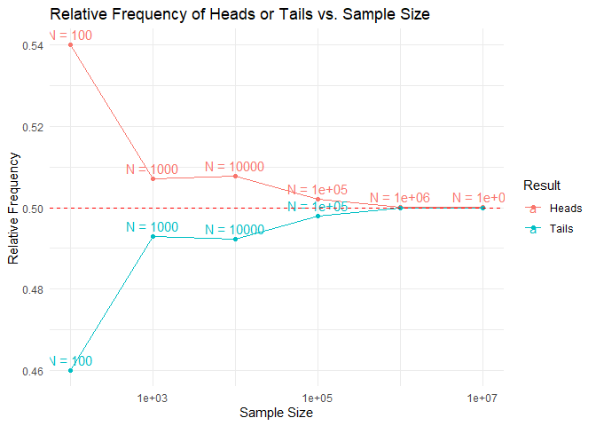
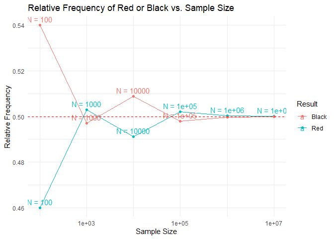

Formative Assessment 2
================

#### Probability and Probability Distribution

#### By Romand Lansangan

### 1. Use R to illustrate that the probability of getting:

    a)  head is 0.5 if a fair coin is tossed repeatedly;
    b)  red card is 0.5 if cards are drawn repeatedly with replacement from awell-shuffled deck;
    c)  an even number is 0.5 if a fair die is rolled repeatedly.

#### a) head is 0.5 if a fair coin is tossed repeatedly;

##### Sample Space:

``` r
  headsOrTails <- c("H", "T")
```

With “H” being heads and “T” as tails.

##### Simulating Experiment:

``` r
a_100 <- sample(headsOrTails, size = 100, replace = TRUE)
a_1000 <- sample(headsOrTails, size = 1000, replace = TRUE)
a_10000 <- sample(headsOrTails, size = 10000, replace = TRUE)
a_100000 <- sample(headsOrTails, size = 100000, replace = TRUE)
a_1000000 <- sample(headsOrTails, size = 1000000, replace = TRUE)
a_10000000 <- sample(headsOrTails, size = 10000000, replace = TRUE)
```

##### Creating Data Frame to display the result and the relative frequency for each experiment size

``` r
a_df <- data.frame(
  result = c("Heads", "Tails"),
  freq_100 = c(sum(a_100 == "H"), sum(a_100 == "T")),
  freq_1000 = c(sum(a_1000 == "H"), sum(a_1000 == "T")),
  freq_10000 = c(sum(a_10000 == "H"), sum(a_10000 == "T")),
  freq_100000 = c(sum(a_100000 == "H"), sum(a_100000 == "T")),
  freq_1000000 = c(sum(a_1000000 == "H"), sum(a_1000000 == "T")),
  freq_10000000 = c(sum(a_10000000 == "H"), sum(a_10000000 == "T")),
  rel_freq_100 = c(sum(a_100 == "H")/100, sum(a_100 == "T")/100),
  rel_freq_1000 = c(sum(a_1000 == "H")/1000, sum(a_1000 == "T")/1000),
  rel_freq_10000 = c(sum(a_10000 == "H")/10000, sum(a_10000 == "T")/10000),
  rel_freq_100000 = c(sum(a_100000 == "H")/100000, sum(a_100000 == "T")/100000),
  rel_freq_1000000 = c(sum(a_1000000 == "H")/1000000, sum(a_1000000 == "T")/1000000),
  rel_freq_10000000 = c(sum(a_10000000 == "H")/10000000, sum(a_10000000 == "T")/10000000)
)
a_df
```

    ##   result freq_100 freq_1000 freq_10000 freq_100000 freq_1000000 freq_10000000
    ## 1  Heads       49       497       4956       50122       499708       4997826
    ## 2  Tails       51       503       5044       49878       500292       5002174
    ##   rel_freq_100 rel_freq_1000 rel_freq_10000 rel_freq_100000 rel_freq_1000000
    ## 1         0.49         0.497         0.4956         0.50122         0.499708
    ## 2         0.51         0.503         0.5044         0.49878         0.500292
    ##   rel_freq_10000000
    ## 1         0.4997826
    ## 2         0.5002174

Where freq_100 is equivalent to frequency under 100 experiment size—and
so on.

“rel_freq_100”, however, is equivalent to relative frequency under 100
experiment. The relative frequency (f) is given by the equation:
$$ f = \frac{n}{N} $$ where $n$ is the number of times the event occurs,
and $N$ is the total number of trials.

##### Creation of Line Graph to display the result:

``` r
library(ggplot2)

a_long_df <- tidyr::pivot_longer(a_df, cols = starts_with("rel_freq"),
                               names_to = "sample_size", values_to = "rel_freq")

a_long_df$sample_size <- gsub("rel_freq_", "", a_long_df$sample_size)
a_long_df$sample_size <- as.numeric(a_long_df$sample_size)

ggplot(a_long_df, aes(x = sample_size, y = rel_freq, color = result)) +
  geom_line() +
  geom_point() +
  geom_text(aes(label = paste("N =", sample_size)), vjust = -0.5, check_overlap = TRUE) +
  scale_x_log10() +
  labs(title = "Relative Frequency of Heads or Tails vs. Sample Size",
       x = "Sample Size",
       y = "Relative Frequency",
       color = "Result") +
  theme_minimal() +
  geom_hline(yintercept = 0.5, linetype = "dashed", color = "red")
```

<!-- -->

As one can notice, as the size of the experiment becomes larger, the
relative frequency for both outcome (heads and tails) approaches 0.50.
This goes to show that the probability of both heads and tails is
$\textbf{0.50}$.

#### b) red card is 0.5 if cards are drawn repeatedly with replacement from awell-shuffled deck;

##### Sample Space:

``` r
  deckOfCardsColors <- c("R", "B")
```

With “R” being Red and “B” as Black.

Instead of creating a list for a whole deck of cards, the author just
made a list with red and black as its elements due to the fact that the
two colors are the only possible outcomes and they have similar total
cards under them in a single deck of cards.

##### Simulating Experiment:

``` r
b_100 <- sample(deckOfCardsColors, size = 100, replace = TRUE)
b_1000 <- sample(deckOfCardsColors, size = 1000, replace = TRUE)
b_10000 <- sample(deckOfCardsColors, size = 10000, replace = TRUE)
b_100000 <- sample(deckOfCardsColors, size = 100000, replace = TRUE)
b_1000000 <- sample(deckOfCardsColors, size = 1000000, replace = TRUE)
b_10000000 <- sample(deckOfCardsColors, size = 10000000, replace = TRUE)
```

##### Creating Data Frame to display the result and the relative frequency for each experiment size

``` r
b_df <- data.frame(
  result = c("Red", "Black"),
  freq_100 = c(sum(b_100 == "R"), sum(b_100 == "B")),
  freq_1000 = c(sum(b_1000 == "R"), sum(b_1000 == "B")),
  freq_10000 = c(sum(b_10000 == "R"), sum(b_10000 == "B")),
  freq_100000 = c(sum(b_100000 == "R"), sum(b_100000 == "B")),
  freq_1000000 = c(sum(b_1000000 == "R"), sum(b_1000000 == "B")),
  freq_10000000 = c(sum(b_10000000 == "R"), sum(b_10000000 == "B")),
  rel_freq_100 = c(sum(b_100 == "R")/100, sum(b_100 == "B")/100),
  rel_freq_1000 = c(sum(b_1000 == "R")/1000, sum(b_1000 == "B")/1000),
  rel_freq_10000 = c(sum(b_10000 == "R")/10000, sum(b_10000 == "B")/10000),
  rel_freq_100000 = c(sum(b_100000 == "R")/100000, sum(b_100000 == "B")/100000),
  rel_freq_1000000 = c(sum(b_1000000 == "R")/1000000, sum(b_1000000 == "B")/1000000),
  rel_freq_10000000 = c(sum(b_10000000 == "R")/10000000, sum(b_10000000 == "B")/10000000)
)
b_df
```

    ##   result freq_100 freq_1000 freq_10000 freq_100000 freq_1000000 freq_10000000
    ## 1    Red       52       494       4932       49751       500469       5000259
    ## 2  Black       48       506       5068       50249       499531       4999741
    ##   rel_freq_100 rel_freq_1000 rel_freq_10000 rel_freq_100000 rel_freq_1000000
    ## 1         0.52         0.494         0.4932         0.49751         0.500469
    ## 2         0.48         0.506         0.5068         0.50249         0.499531
    ##   rel_freq_10000000
    ## 1         0.5000259
    ## 2         0.4999741

Similar to the above item, freq_100 is equivalent to frequency under 100
experiment size—and so on.

Also, “rel_freq_100” is equivalent to relative frequency under 100
experiment.

##### Creation of Line Graph to display the result:

``` r
b_long_df <- tidyr::pivot_longer(b_df, cols = starts_with("rel_freq"),
                               names_to = "sample_size", values_to = "rel_freq")

b_long_df$sample_size <- gsub("rel_freq_", "", b_long_df$sample_size)
b_long_df$sample_size <- as.numeric(b_long_df$sample_size)

ggplot(b_long_df, aes(x = sample_size, y = rel_freq, color = result)) +
  geom_line() +
  geom_point() +
  geom_text(aes(label = paste("N =", sample_size)), vjust = -0.5, check_overlap = TRUE) +
  scale_x_log10() +
  labs(title = "Relative Frequency of Red or Black vs. Sample Size",
       x = "Sample Size",
       y = "Relative Frequency",
       color = "Result") +
  theme_minimal() +
  geom_hline(yintercept = 0.5, linetype = "dashed", color = "red")
```

<!-- -->

Similar to the graph in the first item (a), both outcome seems to be
approaching 0.50 and thus the probability for both red and black is
$\textbf{0.50}$.

#### c) an even number is 0.5 if a fair die is rolled repeatedly.

##### Sample Space:

``` r
  die <- c("E", "O")
```

With “E” being even and “O” as odd numbers.

Similar to second item (b), instead of creating a list with elements 1
through 6, the author just made a list with even and odd as its elements
due to the fact that there exists only two parity for a natural number
and they have similar total numbers under them (3 each) in a single die.

##### Simulating Experiment:

``` r
c_100 <- sample(die, size = 100, replace = TRUE)
c_1000 <- sample(die, size = 1000, replace = TRUE)
c_10000 <- sample(die, size = 10000, replace = TRUE)
c_100000 <- sample(die, size = 100000, replace = TRUE)
c_1000000 <- sample(die, size = 1000000, replace = TRUE)
c_10000000 <- sample(die, size = 10000000, replace = TRUE)
```

##### Creating Data Frame to display the result and the relative frequency for each experiment size

``` r
c_df <- data.frame(
  result = c("Even", "Odd"),
  freq_100 = c(sum(c_100 == "E"), sum(c_100 == "O")),
  freq_1000 = c(sum(c_1000 == "E"), sum(c_1000 == "O")),
  freq_10000 = c(sum(c_10000 == "E"), sum(c_10000 == "O")),
  freq_100000 = c(sum(c_100000 == "E"), sum(c_100000 == "O")),
  freq_1000000 = c(sum(c_1000000 == "E"), sum(c_1000000 == "O")),
  freq_10000000 = c(sum(c_10000000 == "E"), sum(c_10000000 == "O")),
  rel_freq_100 = c(sum(c_100 == "E")/100, sum(c_100 == "O")/100),
  rel_freq_1000 = c(sum(c_1000 == "E")/1000, sum(c_1000 == "O")/1000),
  rel_freq_10000 = c(sum(c_10000 == "E")/10000, sum(c_10000 == "O")/10000),
  rel_freq_100000 = c(sum(c_100000 == "E")/100000, sum(c_100000 == "O")/100000),
  rel_freq_1000000 = c(sum(c_1000000 == "E")/1000000, sum(c_1000000 == "O")/1000000),
  rel_freq_10000000 = c(sum(c_10000000 == "E")/10000000, sum(c_10000000 == "O")/10000000)
)
c_df
```

    ##   result freq_100 freq_1000 freq_10000 freq_100000 freq_1000000 freq_10000000
    ## 1   Even       45       505       4966       50005       500008       5000368
    ## 2    Odd       55       495       5034       49995       499992       4999632
    ##   rel_freq_100 rel_freq_1000 rel_freq_10000 rel_freq_100000 rel_freq_1000000
    ## 1         0.45         0.505         0.4966         0.50005         0.500008
    ## 2         0.55         0.495         0.5034         0.49995         0.499992
    ##   rel_freq_10000000
    ## 1         0.5000368
    ## 2         0.4999632

Similar to the above items, freq_100 is equivalent to frequency under
100 experiment size—and so on.

Also, “rel_freq_100” is equivalent to relative frequency under 100
experiment.

##### Creation of Line Graph to display the result:

``` r
c_long_df <- tidyr::pivot_longer(c_df, cols = starts_with("rel_freq"),
                                 names_to = "sample_size", values_to = "rel_freq")

c_long_df$sample_size <- gsub("rel_freq_", "", c_long_df$sample_size)
c_long_df$sample_size <- as.numeric(c_long_df$sample_size)

ggplot(c_long_df, aes(x = sample_size, y = rel_freq, color = result)) +
  geom_line() +
  geom_point() +
  geom_text(aes(label = paste("N =", sample_size)), vjust = -0.5, check_overlap = TRUE) +
  scale_x_log10() +
  labs(title = "Relative Frequency of Even or Odd vs. Sample Size",
       x = "Sample Size",
       y = "Relative Frequency",
       color = "Result") +
  theme_minimal() +
  geom_hline(yintercept = 0.5, linetype = "dashed", color = "red")
```

<!-- -->
Similar to the graphs of both numbers above, both outcome seems to be
approaching 0.50 and thus the probability for both odd and even numbers
is $\textbf{0.50}$.

#### Conclusion:

As the graphs above exhibited, in experiments based on randomization,
the probability of each element will be 1 / number of possible outcomes.

It is important to note that the behavior of the graph may deviate from
a straight line due to the inherent variability in random processes.
This is to be expected in an experiment that rely on randomness. Despite
that being the case, it is clear that as larger the size of the
experiments become, each outcome’s relative frequency approach their
actual probability and that the deviations become less relevant.

### 2. An experiment consists of tossing two fair coins. Use R to simulate this experiment 100 times and obtain the relative frequency of each possible outcome. Hence, estimate the probability of getting one head and one tail in any order.

##### Sample Space:

``` r
  twoCoins <- c("HH", "TT","HT","TH")
```

With one “H” as heads and one “T” as tails.

##### Simulating Experiment:

``` r
  sec_rand <- sample(twoCoins, size = 100, replace = TRUE)
```

With experiment done 100 times, thus the “size = 100”.

##### Creating Data Frame to display the result and the relative frequency for each experiment size

``` r
sec_df <- data.frame(
  result = c("Two Heads", "Two Tails", "Split"),
  freq = c(sum(sec_rand == "HH"), sum(sec_rand == "TT"), sum(sec_rand == "TH") + sum(sec_rand == "HT")),
  rel_freq = c(sum(sec_rand == "HH")/100, sum(sec_rand == "TT")/100, (sum(sec_rand == "TH") + sum(sec_rand == "HT"))/100)
)
sec_df
```

    ##      result freq rel_freq
    ## 1 Two Heads   26     0.26
    ## 2 Two Tails   25     0.25
    ## 3     Split   49     0.49

#### Conclusion:

In theory, the probability of getting two heads, two tails, and (1 head
and 1 tails in any order) is 0.25, 0.25, and 0.50, respectively. This
exact number might not appear on the table but as what was said earlier,
when the number of times the experiments was repeated increases, it
shall approach its actual probability. Nevertheless, based on the table
above, in an experiment of tossing a two fair coins 100 times, the
relative frequency for two heads, two tails, and split (1 head and 1
tails in any order) are $\textbf{0.23}$, $\textbf{0.26}$, and
$\textbf{0.51}$, respectively (or something around the ballpark; cannot
be sure because it is a randomized experiment and it’ll likely to change
even slightly every time).

### 3) An experiment consists of rolling a die. Use R to simulate this experiment 600 times and obtain the relative frequency of each possible outcome. Hence, estimate the probability of getting each of 1, 2, 3, 4, 5, and 6.

##### Sample Space:

``` r
  die <- c(1, 2, 3, 4, 5, 6)
```

##### Simulating Experiment:

``` r
  third_rand <- sample(die, size = 600, replace = TRUE)
```

With experiment done 600 times, thus the “size = 600”.

##### Creating Data Frame to display the result and the relative frequency for each experiment size

``` r
third_df <- data.frame(
  result = c("1", "2", "3", "4", "5", "6"),
  freq = c(sum(third_rand == 1), sum(third_rand == 2), sum(third_rand == 3), sum(third_rand == 4), sum(third_rand == 5), sum(third_rand == 6)),
  rel_freq = c(sum(third_rand == 1)/600, sum(third_rand == 2)/600, sum(third_rand == 3)/600, sum(third_rand == 4)/600, sum(third_rand == 5)/600, sum(third_rand == 6)/600)
)
third_df
```

    ##   result freq  rel_freq
    ## 1      1   97 0.1616667
    ## 2      2  114 0.1900000
    ## 3      3   91 0.1516667
    ## 4      4   93 0.1550000
    ## 5      5  102 0.1700000
    ## 6      6  103 0.1716667

#### Conclusion:

In theory, the probability of each result in a die is 1/6 or
approximately 0.1667. This exact number might not appear on the table
but as what was said earlier, when the number of times the experiments
was repeated increases, it shall approach its actual probability.
Nevertheless, based on the table above, in an experiment of rolling a
die coins 600 times, the relative frequency for each outcome is
relatively similar to each other.

To show the validity of the claim the they are indeed around 0.1667,
here is the average of rel_freq:

``` r
mean(third_df[["rel_freq"]], na.rm = TRUE)
```

    ## [1] 0.1666667
