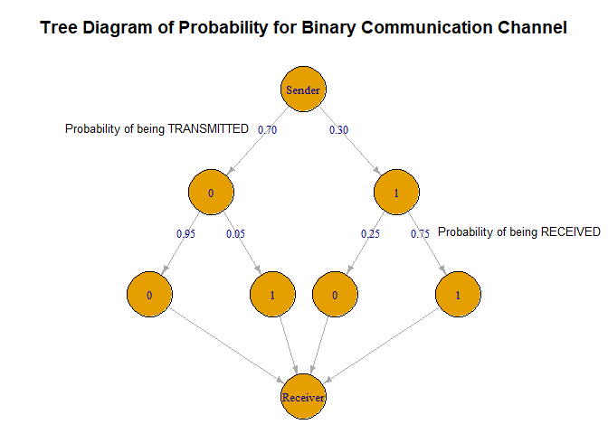
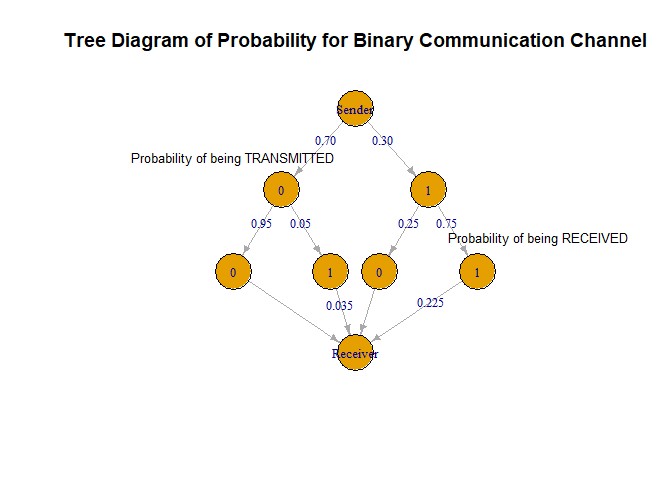

Formative Assessment 3
================

#### Probability and Probability Distribution

#### By Romand Lansangan

### 1)

A binary communication channel carries data as one of two sets of
signals denoted by 0 and 1. Owing to noise, a transmitted 0 is sometimes
received as a 1, and a transmitted 1 is sometimes received as a 0. For a
given channel, it can be assumed that a transmitted 0 is correctly
received with probability 0.95, and a transmitted 1 is correctly
received with probability 0.75. Also, 70% of all messages are
transmitted as a 0. If a signal is sent, determine the probability that:

    (a) a 1 was received;
    (b) a 1 was transmitted given than a 1 was received.

#### Data:

``` r
dataTable_1 <- data.frame(
  message = c(0, 1),
  trans_prob = c(0.70, 0.30),
  rec_prob = c(0.95, 0.75)
)
dataTable_1
```

    ##   message trans_prob rec_prob
    ## 1       0        0.7     0.95
    ## 2       1        0.3     0.75

Where trans_prob is the probability of a message being transmitted and
rec_prob as the probability of them being received correctly.

#### Tree:

To illustrate the problem in a more feasible manner, a tree diagram was
created.

``` r
library(igraph)
```

    ## 
    ## Attaching package: 'igraph'

    ## The following objects are masked from 'package:stats':
    ## 
    ##     decompose, spectrum

    ## The following object is masked from 'package:base':
    ## 
    ##     union

``` r
vertices <- c("Sender", "0", "1", "0", "1", "0", "1", "Receiver")

edges <- matrix(c(
  "Sender", "0",
  "Sender", "1",
  "0", "0_0",
  "0", "0_1",
  "1", "1_0",
  "1", "1_1",
  "0_0", "Receiver",
  "0_1", "Receiver",
  "1_0", "Receiver",
  "1_1", "Receiver"
), byrow = TRUE, ncol = 2)

edge_labels <- c("0.70", "0.30", "0.95", "0.05", "0.25","0.75", "", "", "", "")

g <- graph_from_edgelist(edges, directed = TRUE)
E(g)$label <- edge_labels

V(g)$label <- vertices

layout <- matrix(c(
  -0.5, 0, #sender
  -2, -1, #0
  1, -1, #1
  -3, -2,#0_0
  -1, -2, #0_1
  0, -2,#1_0
  2, -2, #1_1
  -0.5, -3 #Receiver
), ncol = 2, byrow = TRUE)

V(g)$x <- layout[,1]
V(g)$y <- layout[,2]

par(mar = c(0, 0, 3, 0))

plot(g, layout = layout, edge.label = E(g)$label, edge.label.cex = 0.8, vertex.label.cex = 0.8,
     vertex.shape = "circle", vertex.size = 30, edge.arrow.size = 0.5, 
     main = "Tree Diagram of Probability for Binary Communication Channel")

label_coords <- matrix(c(
  -0.95, 0.66,
  1.4, -0.01
), ncol = 2, byrow = TRUE)


text(label_coords[1,1], label_coords[1,2], labels = "Probability of being TRANSMITTED", pos = 3, cex = 0.8)
text(label_coords[2,1], label_coords[2,2], labels = "Probability of being RECEIVED", pos = 3, cex = 0.8)
```

<!-- -->

In this tree diagram, the root (level 0) is the “sender” wherein the
branching edges (and their respective label) represents the probability
that it will be sent. In this case, the “sender” has a 0.70 (or 70%)
chance of transmitting “0” (“0” node at level 1), thus leaving the rest
of possible probability (0.30 or 30%) to transmitting “1” (“1” node at
level 1).

The nodes (level 2) at the end of each edges represents the message that
was sent. The edges that branched out from them represents the
probability of a message being received. In this case, when the “sender”
sent “0,” there is a 0.05 (5%) chance that it will be received by the
receiver as “1”—and so on.

#### A) 1 was received.

To calculate the probability of message being correctly (and wrongly)
received, we shall use the Multiplication Law of Probability.

##### Multiplication Law of Probability:

The Multiplication Law of Probability is defined as the following:

$$
P(E_{1} \cap E_{2}) = P(E_{2}|E_{1})P(E_{1})
$$

Let $E_{1}$ be an event in which “1” was received;

Let $A$ be the case in which the “sender” sent “0”;

Let $B$ be the case in which the “sender” sent “1”.

For calculating the probability of “1” being received, we have 2
possibilities. One being that the “sender” sent “1” and it was correctly
received ( $P(B \cap E_{1})$ ) and the “sender” transmitted “0” and was
incorrectly received ( $P(A \cap E_{1})$ ). With all that in mind, we’ll
have the following:

The probability of the event where “0” was transmitted and was
incorrectly received is denoted as:

$$
P(A \cap E_{1}) = P(E_{1}|A)P(A)
$$

##### Solution:

Substituting the values we get

$$
P(A \cap E_{1}) = 0.05 \times 0.70
$$

``` r
0.05 * 0.70
```

    ## [1] 0.035

$$
P(A \cap E_{1}) = 0.035
$$

Similarly, for the probability of “1” being transmitted and was
correctly received can be derived with

$$
P(B \cap E_{1}) = P(E_{1}|B)P(B)
$$

And with values:

$$
P(B \cap E_{1}) = 0.75 \times 0.30
$$

``` r
0.75 * 0.30
```

    ## [1] 0.225

$$
P(B \cap E_{1}) = 0.225
$$

``` r
edge_labels <- c("0.70", "0.30", "0.95", "0.05", "0.25","0.75", "", "0.035", "", "0.225")

E(g)$label <- edge_labels

plot(g, layout = layout, edge.label = E(g)$label, edge.label.cex = 0.8, vertex.label.cex = 0.8,
     vertex.shape = "circle", vertex.size = 30, edge.arrow.size = 0.5, 
     main = "Tree Diagram of Probability for Binary Communication Channel")

label_coords <- matrix(c(
  -1, 0.48,
  1.5, -0.18
), ncol = 2, byrow = TRUE)


text(label_coords[1,1], label_coords[1,2], labels = "Probability of being TRANSMITTED", pos = 3, cex = 0.8)
text(label_coords[2,1], label_coords[2,2], labels = "Probability of being RECEIVED", pos = 3, cex = 0.8)
```

<!-- -->

Since we are calculating for the probability that a “1” was received,
the “receiver” must only receive one and it doesn’t particularly matter
if it’s either “0” or “1” was originally transmitted. With this in mind,
because the two cases mentioned above were mutually exclusive (due to
the fact that they can’t happen at the same time), we can use the Law of
Total Probability.

##### Law of Total Probability:

The Law of Total Probability is defined as the following:

If a sample space $S$ can be partitioned into k mutually exclusive and
exhaustive events, $A_{1}$, $A_{2}$, $A_{3}$, … , $A_{k}$, then for any
event $E$:

$$
P(E) = P(A_{1})P(E|A_{1}) + P(A_{2})P(E|A_{2}) + P(A_{3})P(E|{A_{3}}) + ... P(A_{k})P(E|A_{k})
$$

With that, we’ll have

$$
P(E_{1}) = P(E_{1}|A)P(A) + P(E_{1}|B)P(B)
$$

$$
P(E_{1}) = 0.035 + 0.225
$$

``` r
0.035 + 0.225
```

    ## [1] 0.26

Thus, the total probability of receiving a “1” is:

$$
P(E_{1}) = 0.26
$$

#### B) 1 was transmitted given than a 1 was received.

Let $E_{1}$ be an event in which “1” was received;

Let $B$ be the case in which the “sender” transmitted 1.

We can rewrite this particular problem as a conditional probability:

##### Conditional Probability:

The conditional probability is defined as

$$
P(E_{2}|E_{1}) = \frac{P(E_{2} \cap E_{1})}{P(E_{1})}
$$

##### Solution:

Applying the formula to the problem,

$$
P(B|E_{1}) = \frac{P(B \cap E_{1})}{P(E_{1})}
$$

Substituting the values we get:

$$
P(B|E_{1}) = \frac{0.225}{0.26}
$$

``` r
0.225/0.26
```

    ## [1] 0.8653846

Thus, the probability that “1” was transmitted given than a “1” was
received is

\$\$ P(B\|E\_{1}) ~ or ~ 86.54 %

\$\$

### 2)

There are three employees working at an IT company: Jane, Amy, and Ava,
doing 10%, 30%, and 60% of the programming, respectively. 8% of Jane’s
work, 5% of Amy’s work, and just 1% of Ava‘s work is in error.

    (a) What is the overall percentage of error? 
    (b) If a program is found with an error, who is the most likely person to have written it? 

#### Data:

``` r
dataTable_2 <- data.frame(
  employee = c("Jane", "Amy", "Ava"),
  workload = c(0.10, 0.30, 0.60),
  error_prob_rel_to_workload = c(0.08, 0.05, 0.01)
)
dataTable_2
```

    ##   employee workload error_prob_rel_to_workload
    ## 1     Jane      0.1                       0.08
    ## 2      Amy      0.3                       0.05
    ## 3      Ava      0.6                       0.01

#### A) What is the overall percentage of error?

This is a straightforward problem that requires both the Law of
Multiplication of Probability and Law of Total Probability—both of which
are mentioned earlier.

##### Solution:

Let $A_{1}$ be Jane’s worload;

Let $A_{2}$ be Amy’s workload;

Let $A_{3}$ be Ava’s workload.

Let $E$ be the event in which their work produced an error or two.

Using the Law of Total Probability, we will have

$$
P(E) = P(A_{1})P(E|A_{1}) + P(A_{2})P(E|A_{2}) + P(A_{3})P(E|{A_{3}})
$$ Substituting the values will give us $$
P(E) = (0.1 \times 0.08) + (0.3 \times 0.05) + (0.6 \times 0.01)
$$

``` r
(0.1*0.08)+(0.3*0.05)+(0.6*0.01)
```

    ## [1] 0.029

Thus, the total probability of getting an error (overall percentage of
error) between the three is

\$\$ P(E) = 0.029 ~ or ~ 2.9 %

\$\$

#### B) If a program is found with an error, who is the most likely person to have written it?

##### Solution:

For this problem, we’ll just have to multiply the workload and the
percentage of error (error_prob_rel_to_workload). This ought to give us
the probability that an error will occur in their work.

``` r
dataTable_2$error_prob_rel_to_total <- dataTable_2$workload * dataTable_2$error_prob_rel_to_workload
dataTable_2
```

    ##   employee workload error_prob_rel_to_workload error_prob_rel_to_total
    ## 1     Jane      0.1                       0.08                   0.008
    ## 2      Amy      0.3                       0.05                   0.015
    ## 3      Ava      0.6                       0.01                   0.006

``` r
dataTable_2[which.max(dataTable_2$error_prob_rel_to_total), "employee"]
```

    ## [1] "Amy"

Since $Amy$ has the highest probability to commit an error (relative to
the total), with a probability of $0.015$ or \$1.5 % \$, if a program is
found with an error, she will most likely be the person who has written
it.
