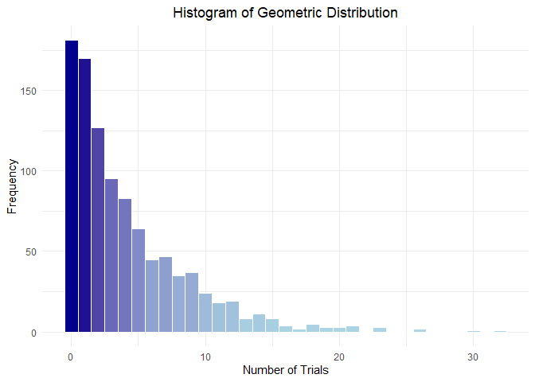

Formative Assessment 6
================

#### Probability and Probability Distribution

#### By Romand Lansangan

### 1) Geometric Distribution

Provide an R code for the geometric distribution. The geometric
distribution is a probability distribution that models the number of
trials required to achieve the first success in a sequence of Bernoulli
trials, where each trial has a constant probability of success.

#### a.Set the probability of success: p \<- 0.2

``` r
p <- 0.2
```

#### b. Generate 1000 random variables from the geometric distribution.

``` r
random_count <- 1000
random_var <- rgeom(random_count, p)
random_var
```

    ##    [1]  3  0  2  1  5  1  1  1  0  0  3  1  1  0  2  0  1  5  2  0 12  0  1  2
    ##   [25]  3  6  1  0  0  3  2  8  3  4  3  6  0 10 14  0  9  4 11  0  1  4  6  2
    ##   [49]  0  2  0  2  1  2  3  2  1  7 23  0  0 19  2  0  0  1  1  6  8 13  9  2
    ##   [73]  4  0  1 15  0  5  6  7  0  8  1 14  4  3  2  0  5  0  2  0  0  1  4  0
    ##   [97]  4  3  3 14  3  3  1 10  3  0  7  5  5  0  0  1  0  8  0  0  7  5  1  5
    ##  [121]  7  8  3  2  0  9  0  2  2  0  2 18  1  4  8  5  0  6  2  5 10  6  3  1
    ##  [145]  1  1  6  8  3  2  0 12  6  0  2  0  9  4  5  9  5  0  4 10  4 16  2  1
    ##  [169]  0 12  3  4  1  0  0  0 10  0  2  1  1  0  5  6  7  4  1  4  1 18 10  0
    ##  [193]  0  9  3  5  0  4  2  1  9  2  3  4  5  2  3  2  0  0 10  5  4  0  3  4
    ##  [217]  0  7  6  2 11 11  5  1  0 12  3  4  1  4  4 13  2  0  2  3  0 12  9 10
    ##  [241]  0  1  4 11  2  1  1  1  9  1  3  2  3  3  1  6  5 14  3  0  2  0  4 23
    ##  [265]  4  3  9  0 14  4  0  6 15  1  5  1  9  1  3  2  3  0  0  3  5 32  2 15
    ##  [289]  0  2  1  1  7  0  2  4  1 11 16  5  1 26  4  6  5  5  1  2  0  0  4  9
    ##  [313]  0 17  4  6  1  3  4  0  7  2 11  2  0  7  6  5  2  8  2  1  0  3  2  5
    ##  [337]  3 10  2  4 11  7  2  0  3  2  9  4  6  0  2  3  0  6  5  0  5  9  9  2
    ##  [361]  1  1  1  0  2  5  1  0  6  8  1  3  0  1  1 13  4  1  3  7  8  1  9  9
    ##  [385]  1  5  1 10  1  0  1  3  5  2  6  5  8  7  0  0  3  8 12  1  4 17  9  1
    ##  [409] 18  8  6  6  0  2  1  5  2  5  0  2  0  8  1 11  9  4  5  4 13  3  9 15
    ##  [433]  3  9  0  1  3  3  3  2  0  0  8  0  2  7  1  1 10  1  1  2  1  2  0 10
    ##  [457]  1 12  0  3  5  0  8  1  0  1  0  0  3  1  0  5  8  0  5  1  7  4  1  2
    ##  [481]  6  1  4 21  2  4  2  2  5  6  3  2  1  0  0  0  1  7  0  2  0  0  1  4
    ##  [505]  1  6  1  2  1 13  1 14  0  6  7  8  2  1  2  0  9  0  1  1  0  5  5 10
    ##  [529]  4  0  4  0  0  2  4 15 16  3  1  2  0  3  1  4  1  1  1  7  3  8  7  3
    ##  [553]  1  1  1 19  9  4 12  4  0  1  0  0  5  2  4  3  0  1 11  3  8  6 11  1
    ##  [577] 15  4  7  3  6  2  0  9  0  1  1  8 10  0  0  0  6  2  0  4  1  0  3  4
    ##  [601]  7  2  4  1  2  4  1  1  0  1  1  2  1  0  0  2  1  4  1  7 12  8  0  6
    ##  [625]  9  0  0  4  0  3 12  1  2  2  1  4  0  1  3  3  0  2  2  7 14  5  1  0
    ##  [649] 10  4  3  4  7  3  2  2  4  0  2  1 21  2  6  2  0  2 13  7  5  4  2  0
    ##  [673] 10  5  1  1 12  2  1  2  9  2  1  0  3 18  1  2  2  2  2 20  0  3  1  0
    ##  [697]  7  4  4  0 10 10  2  3 20  6  0  7  5  2 10  0  4  1  0  2  4  2  2 11
    ##  [721]  6 11 12  2  1  3 21  8  1  2 12  9  4  4  4  2  2  0  2  2  9  7  5  0
    ##  [745]  0  5  1  7  9  1  4  8  3  3  0  2  2  8  8  0  1  4  5  0  0  1  6  7
    ##  [769]  3  6  1  3  1  1  8 19 23  0 12 12  2 11  9  3 12  5  3  3  3  4  0  2
    ##  [793]  2  7  5  4 14  1  2  4 13  6  6  9  6  2  3  1  0  4 11  6  3  6  9  1
    ##  [817]  2 12  5 15  1  0  5  0  0  0  2  1  1  4  3  3  1  1  1  0  2  1  0  4
    ##  [841]  3  5  9  2  3  2 10  7  6  3  0  0  3  4  6  3  1  7  1  5  9  0  3  1
    ##  [865]  0  0  7  3  1  4  1  8  8  5  8  5 10  7  3  0  1  1  5  8  3 11  2  6
    ##  [889]  7 30 14  0  0  3  7  0  2  6  5  3  2  2  6  2  5  1  1  1  1 14  2  4
    ##  [913]  4 16  4  0  7  3  3 10  1  1 10  0  5  5  3  4  8  1  7  5  0  3  4 10
    ##  [937] 18  1  4  9  0  5  0  2 13  2  1  1  7  8 15  0  1  1  7  0  7  7  0  5
    ##  [961]  1  0  0  0 11  0  1  3 21  7  2  0  9  1 26  2  1 14  2  7  3  3  1  1
    ##  [985] 20  8  4 12  0  8  1 12  0 11 11  1  9  7  1  7

#### c.Calculate some basic statistics:

``` r
mean_var <- mean(random_var)

var_var <- var(random_var)

sd_var <- sd(random_var)
```

#### d. Print the results in item 3 with the following output (string):

``` r
results <- list(paste('Number of trials required to achieve first success: ', random_var[1]),
paste('Mean (in 2 decimal places): ', mean_var),
paste('Variance (in 2 decimal places): ', var_var), paste('Sandard deviation ( in 2 decimal places): ', sd_var))
for(i in results){print(i)}
```

    ## [1] "Number of trials required to achieve first success:  3"
    ## [1] "Mean (in 2 decimal places):  4.189"
    ## [1] "Variance (in 2 decimal places):  20.8481271271271"
    ## [1] "Sandard deviation ( in 2 decimal places):  4.56597493719875"

#### e. Plot the histogram of the results.

``` r
library(ggplot2)

df <- data.frame(Trials = random_var)
ggplot(df, aes(x = Trials, fill = after_stat(count))) +
  geom_histogram(color = "white", binwidth = 1, show.legend = FALSE) + 
  scale_fill_gradient(low = "lightblue", high = "darkblue") +
  labs(title = "Histogram of Geometric Distribution",
       x = "Number of Trials",
       y = "Frequency") +
  theme_minimal() +
  theme(plot.title = element_text(hjust = 0.5))
```

<!-- -->

The probability of achieving the desired result in a geometric
distribution increases as the number of failures in an experiment
increases. Thus the result of the histogram that indicates the frequency
(among 1000 random experiments) of achieving the desired result
decreases as the number of trials increases.

### 2) Hypergeometric Distribution

Consider a plant manufacturing IC chips of which 10% are expected to be
defective. The chips are packed in boxes for export. Before
transportation, a sample is drawn from each box. Estimate the
probability that the sample contains more than 10% defectives, when:

#### a. A sample of 10 is selected from a box of 40.

Since 10% of 10 is 1, we’re interested in avoiding zero defective items.
By first finding the probability of drawing zero defective items and
subtracting this from 1, we get the probability of drawing at least one
defective item. In that way, it will be easy for us to calculate the
probability that we desire.

``` r
total <- 40
sample_size <- 10
defective_actual <- total * 0.10
not_defective <- total - defective_actual

probability_0_defective <- phyper(0, defective_actual, not_defective, sample_size)

probability_at_least_1_defective <- 1 - probability_0_defective

probability_at_least_1_defective
```

    ## [1] 0.7001313

#### b. A sample of 10 is selected from a box of 5000.

``` r
total <- 5000
sample_size <- 10
defective_rate <- 0.10

defective_actual <- total * 0.10
not_defective <- total - defective_actual

probability_0_defective <- phyper(0, defective_actual, not_defective, sample_size)

probability_at_least_1_defective <- 1 - probability_0_defective

probability_at_least_1_defective
```

    ## [1] 0.6516705
