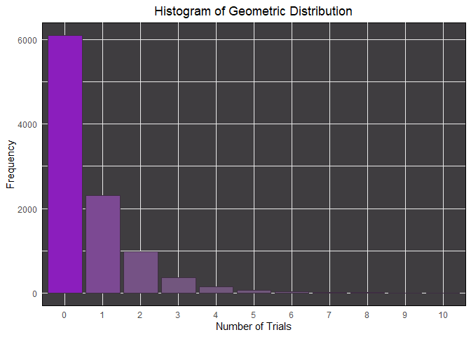

Summative Assessment 1
================

#### Probability and Probability Distribution

#### By Romand Lansangan & Jordan Dacanay

### 1)

A company has three factories producing a product. Factory 1 produces
$x_1$ of the product, Factory 2 produces $x_2$ , and Factory 3 produces
$x_3$ , where $\Sigma_{i=1}^3x_i = 1$ . The defective rates of the
products are $y_1$ , $y_2$ , and \$y_3% , respectively, where
$\Sigma_{i=1}^3y_i = 0.12$ . Write a program (user input for $x_i$ and
$y_1$ ) to calculate the probability that a randomly selected product is
defective.

Note that your program should render prompt message to satisfy the
following conditions:

- $(0.10 \leq x_i \leq 0.40) \wedge (\Sigma_{i=1}^3x_i = 1)$
- $(0.05 \leq y_i \leq 0.10) \wedge (\Sigma_{i=1}^3y_i = 0.12)$

#### Input algorithm for x:

    repeat {
      x <- 1;
      halu_x = c()
      while (x <= 3){
        var = as.double(readline(prompt = paste("Enter the probability of Factory ", x, " producing a product: ")))
        if (0.10 <= var && var <= 0.40){
          halu_x = c(halu_x, var)
          x <- x + 1;
        }else{
          print(paste("Probability should be greater than 0.10 and less than 0.40"))
        }
      }
      sum_x <- sum(halu_x);
      if (sum_x == 1){
        break
      }else{
        print("Probabilities must add up to 1")
      }
    }

### Input algorithm for y:

    repeat {
      y <- 1;
      halu_y = c()
      while (y <= 3){
        var = as.double(readline(prompt = paste("Enter the probability of Factory ", y, " to produce a defective: ")))
        if (0.05 <= var && var <= 0.10){
          halu_y = c(halu_y, var)
          y <- y + 1;
        }else{
          print(paste("Probability should be greater than 0.10 and less than 0.40"))
        }
      }
      sum_y <- sum(halu_y);
      if (sum_y == 0.12){
        break
      }else{
        print("Probabilities must add up to 0.12")
      }
    }

Note: I commented it out for the sake of presentation in markdown
format. Nevertheless, the code does work when ran through R compiler.

We shall use the following arbitrary values to calculate for the desired
probability.

``` r
halu_x <- c(0.33, 0.33, 0.34)
halu_y <- c(0.0322, 0.0637, 0.0241)
```

``` r
data_1 <- data.frame(
  factory = c(1:3),
  prob_production = halu_x,
  prob_defective_withRespectTo_factory = halu_y
  )
data_1
```

    ##   factory prob_production prob_defective_withRespectTo_factory
    ## 1       1            0.33                               0.0322
    ## 2       2            0.33                               0.0637
    ## 3       3            0.34                               0.0241

#### Checking if the values does meet the criteria:

The sum of all x (prob_production) should be equals to 1,

``` r
sum(data_1$prob_production) == 1
```

    ## [1] TRUE

The sum of all y (prob_defective_withRespectTo_factory) should be equals
to 0.12,

``` r
tolerance <- .Machine$double.eps^0.5

sum(data_1$prob_defective_withRespectTo_factory) - 0.12 < tolerance
```

    ## [1] TRUE

Tolerance is a very small number to avoid floating-point arithmetic
issues.

``` r
tolerance
```

    ## [1] 1.490116e-08

#### Calculating for the probability of defective products among all the factories

Let $E$ be the event where a factory produces the defective product.

Let $A_1$ be the event where Factory 1 produces a product.

Let $A_2$ be the event where Factory 2 produces a product.

Let $A_3$ be the event where Factory 3 produces a product.

With that, the $E \cap A_k$ where $k \in \{1,2,3\}$ means that a product
produced from Factory $k$ is defective.

To calculate the probability of each factory producing a defection (with
respect to the whole sample space), we shall use the Multiplication Law
of Probability.

Given the event $E_1$ and $E_2$ , the Multiplication Law of Probability
is defined as the following:

$$
P(E_{1} \cap E_{2}) = P(E_{2}|E_{1})P(E_{1})
$$

Applying the Multiplication Law of Probability to the problem:

$$
P(E \cap A_1) = P(E|A_1)P(A_1)
$$

$$
P(E \cap A_2) = P(E|A_2)P(A_2)
$$

$$
P(E \cap A_3) = P(E|A_3)P(A_3)
$$

Note that $P(E|A_1)$ is the rate at which the Factory 1 produced a
defective. This goes the same for the rest of factories.

$$
P(E \cap A_1) = 0.0322 \times 0.33
$$

$$
P(E \cap A_2) = 0.0637 \times 0.33
$$

$$
P(E \cap A_3) = 0.0241 \times 0.33
$$

``` r
data_1$prob_defective_withRespectTo_all = data_1$prob_defective_withRespectTo_factory * data_1$prob_production
data_1
```

    ##   factory prob_production prob_defective_withRespectTo_factory
    ## 1       1            0.33                               0.0322
    ## 2       2            0.33                               0.0637
    ## 3       3            0.34                               0.0241
    ##   prob_defective_withRespectTo_all
    ## 1                         0.010626
    ## 2                         0.021021
    ## 3                         0.008194

$$
P(E \cap A_1) = 0.010626
$$

$$
P(E \cap A_2) = 0.021021
$$

$$
P(E \cap A_3) = 0.016147
$$

To calculate for $P(E)$ we shall use the Law of Total Probability.

The Law of Total Probability is defined as the following:

If a sample space $S$ can be partitioned into k mutually exclusive and
exhaustive events, $A_{1}$, $A_{2}$, $A_{3}$, … , $A_{k}$, then for any
event $E$:

$$
P(E) = P(A_{1})P(E|A_{1}) + P(A_{2})P(E|A_{2}) + P(A_{3})P(E|{A_{3}}) + ... P(A_{k})P(E|A_{k})
$$

Applying the Law of Total Probability to our problem,

$$
P(E) = P(E \cap A_1) + P(E \cap A_2) + P(E \cap A_3)
$$

Which is also,

$$
P(E) = 0.010626 + 0.021021 + 0.016147
$$

``` r
sum(data_1$prob_defective_withRespectTo_all)
```

    ## [1] 0.039841

The probability that a randomly selected product is defective is:

$$
P(E) = 0.047794
$$

### 3)

By generating 10,000 searches in R, carry out a simulation experiment
for a search engine going through a list of sites for a given key
phrase, until the key phrase is found. You should allow your program to
input the probability p that any site will contain the key phrase.

- Plot the simulated pdf and calculate its mean and variance, and
- Obtain the simulated conditional distribution of searches when three
  searches have been carried out without success. Calculate its mean and
  variance, and satisfy yourself that they are equivalent to the
  simulated distribution of the complete set.

As test data assume each site has a 60% chance of containing the key
phrase.

To satisfy yourself that the Markov memoryless property holds, obtain
estimates of

- $P(X=4|X>4)$ and $P(X=1)$
- $P(X=5|X>3)$ and $P(X=2)$

where x is the number of searches to the first success.

#### Solution:

So this is problem that begs for geometric distribution simulation.

#### Input algorithm for probability:

`#{r} repeat {   prob <- as.double(readline(prompt = "Enter the probability for success: "))   if (0 <= prob && prob <= 1){     break;   } }`

I shall comment it out and assume the following value as user input (as
per instruction):

``` r
prob <- 0.60
```

#### Simulating the experiment:

``` r
searches <- 10000
simulated <- rgeom(searches, prob)
```

#### Plotting the result:

``` r
library(ggplot2)

df <- data.frame(Trials = factor(simulated))

ggplot(df, aes(x = Trials, fill = after_stat(count))) +
  geom_bar(color = "#3e2e42", show.legend = FALSE) + 
  scale_fill_gradient(low = "#70587a", high = "#8b1ebd") +
  labs(title = "Histogram of Geometric Distribution",
       x = "Number of Trials",
       y = "Frequency") +
  theme_minimal() +
  theme(plot.title = element_text(hjust = 0.5),
        panel.background = element_rect(fill = "#3f3d40"))
```

<!-- -->

#### Calculating the mean and variance:

``` r
simulated_mean <- mean(simulated)
simulated_variance <- var(simulated)
print(paste("Mean of the simulated experiment: ", simulated_mean))
```

    ## [1] "Mean of the simulated experiment:  0.6866"

``` r
print(paste("Variance of the simulated experiment: ", simulated_variance))
```

    ## [1] "Variance of the simulated experiment:  1.14329476947695"

#### Proving the Markov property holds in geometeric sequence:

Assume that the probability of each website containing the key phrase is
60% or 0.6.

We must prove: \* $P(X=4|X>4) = P(X=1)$ \* $P(X=5|X>3) = P(X=2)$

For the first part, let us get the P(x=1) and P(x=2) out of the way.

The Probability Density function is defined as the following:

$$
P(X=x) = q^{x−1}p
$$

where p is the probability of success, q is the probability of failure
(1 - p), and x = 1, 2, 3,…

Consequently since p = 0.60, the probability of failure will be q =
0.40.

###### For P(X=1)

$$
P(X=1) = 0.40^{1-1} \times 0.60
$$

$$
P(X=1) = 0.40^0 \times 0.60
$$

$$
P(X=1) = 0.60
$$

##### For P(X=2)

$$
P(X=2) = 0.40^{2-1} \times 0.60
$$

$$
P(X=2) = 0.40^1 \times 0.60
$$

``` r
0.40*0.60
```

    ## [1] 0.24

$$
P(X=2) = 0.24
$$

Then let us now calculate both the conditional probability.

Conditional probability is defined as the following formula:

If A and B are two events in a sample space S, then the conditional
probability of A given B is defined as

$$
P(A|B) = \frac{P(A \cap B)}{P(B)}
$$

Where P(B) \> 0.

##### For P(X=4\|X\>3):

$$
P(X=4|X>3) = \frac{P(X=4 \cap X>3)}{P(X>3)}
$$

The $P(X=4 \cap X>4)$ could also be rewritten as P(X=4) because in
discrete world, x = 4 is the only one that satisfies both x = 4 and x \>
3.

Also, it is worth nothing that:

$$
P(X > 3) = 1 - P(X \leq 3)
$$

With those in mind,

$$
P(X=4|X>3) = \frac{P(X=4)}{1-P(X \leq 3)}
$$

$$
P(X=4) = 0.40^{4-1} \times 0.60
$$

$$
P(X=4) = 0.40^3 \times 0.60
$$

``` r
(0.40^3) * 0.60
```

    ## [1] 0.0384

$$
P(X=4) = 0.0384
$$

The Cumulative Distribution Function of the geometric sequence is
defined as:

$$
P(X \leq x) = 1-q^x
$$ So,

$$
1 - P(X \leq 3) = 1 - (1-q^3) = q^3
$$

Since q = 0.40,

$$
P(X=4|X>3) = \frac{0.0384}{0.40^3}
$$

``` r
0.0384 / (0.40^3)
```

    ## [1] 0.6

$$
P(X=4|X>3) = 0.6
$$

##### For P(X=5\|X\>3):

$$
P(X=5|X>3) = \frac{P(X=5 \cap X>3)}{P(X>3)} = \frac{P(X=5)}{1-P(X \leq 3)}
$$

$$
P(X=5) = 0.40^{5-1} \times 0.60 = 0.40^4 \times 0.60
$$

``` r
(0.40^4) * 0.60
```

    ## [1] 0.01536

$$
P(X=5) = 0.01536
$$

$$
P(X=5|X>3) = \frac{0.01536}{0.40^3}
$$

``` r
(0.01536) / (0.40^3)
```

    ## [1] 0.24

$$
P(X=5|X>3) = 0.24
$$

Since $P(X=4|X>3) = P(X=1)$ (both are 0.60) and $P(X=5|X>3) = P(X=2)$
(both are 0.24) is true, the Markov memoryless property holds in the
Geometric distribution.

Also, to check the validity of our simulation, lets estimate the
Probabilities mentioned above.

``` r
simulated_table <- table(simulated)
simulated_table
```

    ## simulated
    ##    0    1    2    3    4    5    6    7    8    9 
    ## 5905 2437  994  397  163   57   28   11    4    4

Note that X is assumed to be equals to the nth trial. So, X=1 means that
it’s the success that happened on the first try. In the simulation, the
column name indicates the number of failures before achieving the first
success. Therefore, the first trial is equivalent to “0” in our table.

##### For P(X=4\|X\>3):

``` r
prob_for_xeq4 <- (sum(simulated_table[names(simulated_table) == 3]) / sum(simulated_table)) 
prob_for_xgreater3 <- (sum(simulated_table[names(simulated_table) >= 3]) / sum(simulated_table)) 
prob_for_xeq4 / prob_for_xgreater3
```

    ## [1] 0.5978916

#### For P(X=1)

``` r
prob_for_xeq1 <- (sum(simulated_table[names(simulated_table) == 0]) / sum(simulated_table)) 
prob_for_xeq1
```

    ## [1] 0.5905

##### For P(X=5\|X\>3):

``` r
prob_for_xeq5 <- (sum(simulated_table[names(simulated_table) == 4]) / sum(simulated_table)) 
prob_for_xeq5 / prob_for_xgreater3
```

    ## [1] 0.2454819

##### For P(X=2)

``` r
prob_for_xeq2 <- (sum(simulated_table[names(simulated_table) == 1]) / sum(simulated_table)) 
prob_for_xeq2
```

    ## [1] 0.2437

Both of which are relatively close to their respective partner and their
theoretical equivalent.

Therefore validating that the Markov memoryless property also holds on
our simulation.

Sample
