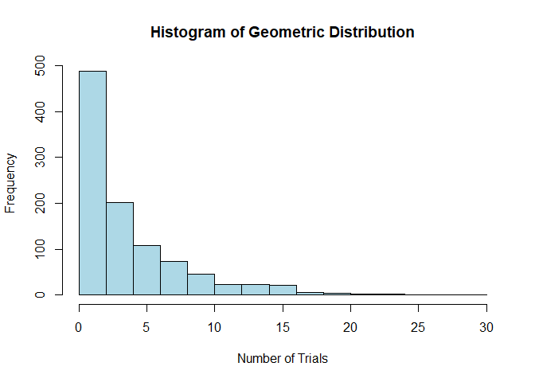

Formative Assessment 6
================
Dwight Gonzales

``` r
# Set CRAN mirror
options(repos = c(CRAN = "https://cran.rstudio.com"))

# Install and load necessary packages
if (!requireNamespace("moments", quietly = TRUE)) {
  install.packages("moments")
}
library(moments)

knitr::opts_chunk$set(echo = TRUE)

# Generate geometric distribution
set.seed(123)  # For reproducibility
p <- 0.2
r <- rgeom(1000, p)
```

``` r
# Print messages to debug
print("Before summary statistics")
```

    ## [1] "Before summary statistics"

``` r
# Calculate summary statistics
mean_r <- mean(r)
var_r <- var(r)
sd_r <- sd(r)

# Print messages to debug
print("After summary statistics")
```

    ## [1] "After summary statistics"

``` r
# Display summary statistics
print(cat("Mean:", round(mean_r, digits = 2), "\n"))
```

    ## Mean: 3.9 
    ## NULL

``` r
print(cat("Variance:", round(var_r, digits = 2), "\n"))
```

    ## Variance: 18.87 
    ## NULL

``` r
print(cat("Standard Deviation:", round(sd_r, digits = 2), "\n"))
```

    ## Standard Deviation: 4.34 
    ## NULL

``` r
print(cat("Number of errors or trials before success (first simulation): ", r[1], "\n"))
```

    ## Number of errors or trials before success (first simulation):  5 
    ## NULL

``` r
# Plot the histogram
hist(r, main = "Histogram of Geometric Distribution", xlab = "Number of Trials", ylab = "Frequency", col = "lightblue", border = "black")
```

<!-- -->

``` r
# Calculate skewness using moments::skewness
skewness_r <- skewness(r)
cat("Skewness:", round(skewness_r, digits = 2), "\n")
```

    ## Skewness: 1.79

``` r
# Calculate kurtosis using moments::kurtosis
kurtosis_r <- kurtosis(r)
cat("Kurtosis:", round(kurtosis_r, digits = 2), "\n")
```

    ## Kurtosis: 6.95

``` r
# Function to calculate binomial probability
binomial_probability <- function(n, k, p) {
  choose(n, k) * p^k * (1 - p)^(n - k)
}

# Print messages to debug
print("Before scenarios")
```

    ## [1] "Before scenarios"

``` r
# Parameters
p_defective <- 0.1

# Scenario 1: Sample of 10 from a box of 40
n1 <- 10
k_values1 <- 1:n1  # Possible number of defectives

# Calculate probability for more than 10% defectives
prob_more_than_10_percent1 <- sum(sapply(k_values1, function(k) binomial_probability(n1, k, p_defective)))

print(cat("Probability of more than 10% defectives in a sample of 10 from a box of 40:", prob_more_than_10_percent1, "\n"))
```

    ## Probability of more than 10% defectives in a sample of 10 from a box of 40: 0.6513216 
    ## NULL

``` r
# Scenario 2: Sample of 10 from a box of 5000
n2 <- 10
k_values2 <- 1:n2  # Possible number of defectives

# Calculate probability for more than 10% defectives
prob_more_than_10_percent2 <- sum(sapply(k_values2, function(k) binomial_probability(n2, k, p_defective)))

print(cat("Probability of more than 10% defectives in a sample of 10 from a box of 5000:", prob_more_than_10_percent2, "\n"))
```

    ## Probability of more than 10% defectives in a sample of 10 from a box of 5000: 0.6513216 
    ## NULL
